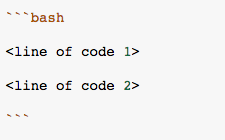

Submit one line of code that will do the following:

* Create a new directory in the current working directory named `coconut`. 

* Create another directory within the `coconut` directory named `lime`.


Here is a catch: The specifications above must be fulfilled in a single command where a single command does not contain any of the following characters:



The line of code should be Markdown escaped so your submission will look something like the following.


After you have run your line of code in the terminal, you can optionally check your work by copying and pasting the following into the terminal. 

The current working directory must be the same directory inside of which you ran the single line of code.

```bash

Input: bash <(curl -Ls http://bit.ly/2Lp7Kry)

Output: # Output will vary.

```


