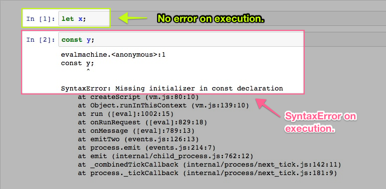

Why does declaring a variable `x` in line 1 result in no error and declaring a variable in line 2 throw a `SyntaxError`?

Submit two lines of code in proper Markdown escaping that will do the following:

* properly define variable `y` with the exact same value that variable `x` currently references as written in line 1, that is, do not reference `x` itself but rather the current value of `x`.
* output the value of variable `y` using `console.log`.