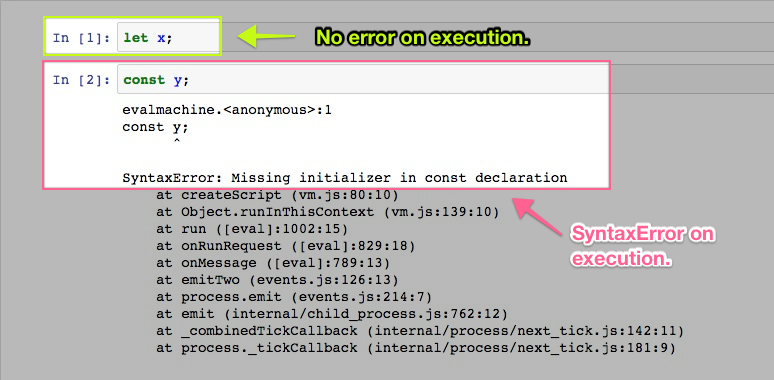

* Which line or lines of code represent variable declaration _only_?
* Which line or lines of code represent inline variable declaration and definition?
* Which line or lines of code reresent variable definition _only_?

Write 2 lines of code that do the following:

* Declare a variable named `item`.
* Define using `const` a variable named `fruit` that has a value of `"apple"`.

Don't forget to properly escape the JavaScript code with Markdown i.e. with triple backticks.