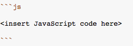

Its very important to understand the different data types in Javascript. It is sometimes hard to remember what data type were dealing with. To solve this mystery, we can always **ask** the element for its type.

Write JavaScript code that includes use of the [typeof](https://developer.mozilla.org/en-US/docs/Web/JavaScript/Reference/Operators/typeof) operator to **output** the data type of each of the values **to the console**.


```js

[
    Symbol(),
    null,
    10,
    "10",
    false,
    { sky: "blue", colors: 100 },
    undefined,
    NaN,
]


```

Submit your answer in Markdown escaping:




The output of the code should look something like this. (This is just an example.)

```javascript
number
string
object
```
