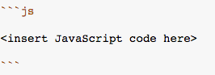

* Which line or lines of code are an example of adding two numbers?
* Which line or lines of code are an example of only string concatenation with no coercion?
* Which line or lines of code are an example of implicit coercion?
* What is the default data type when a value of type number is added to a value of type string?